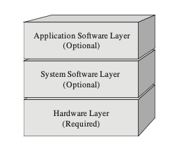
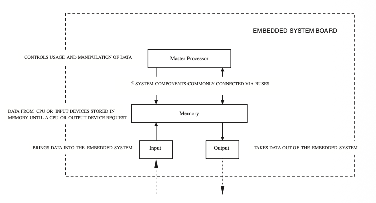

## Overview

**Section I: Introduction to Embedded Systems**

-  **Chapter 1: A Systems Engineering Approach to Embedded Systems Design**
	- Defining embedded systems and the design process.
	-  Introduction to **embedded systems architecture** and its importance.
	- The **Embedded Systems Model** (a layered approach consisting of Hardware, System Software, and Application Software).

- **Chapter 2: Know Your Standards**
	- Overview of programming language and networking standards.
	- Examples including **Digital Television (DTV)** as a multiple standards-based device.

**Section II: Embedded Hardware**

- **Chapter 3: Embedded Hardware Building Blocks and the Embedded Board**
	- Learning to read **schematics** and hardware symbols.
	- The **von Neumann Model** and its application to embedded boards.
	- Basic materials (conductors, insulators, semiconductors) and components (resistors, capacitors, inductors, diodes, transistors).
	- **Integrated Circuits (ICs)** and their role as building blocks.

• **Chapter 4: Embedded Processors**

  - **Instruction Set Architecture (ISA)** models (CISC, RISC, SIMD, VLIW, etc.).

   - Internal processor design (ALU, Control Unit, Registers) and on-chip memory.

   - Processor performance and reading datasheets.

• **Chapter 5: Board Memory**

   - Types of memory (ROM, RAM, Auxiliary memory) and their hierarchies.

   - Memory management units (MMUs) and cache.

• **Chapter 6: Board I/O (Input/Output)**

   - Managing data via **Serial** (RS-232, 802.11) vs. **Parallel** (IEEE 1284) I/O.

   - **Ethernet** networking and communications.

• **Chapter 7: Board Buses**

   - Types of buses (System, Backplane, I/O) and arbitration schemes.

   - Examples: **I2C** and **PCI** buses.

**Section III: Embedded Software Introduction**

• **Chapter 8: Device Drivers**

   - Interrupt-handling, memory, on-board bus, and I/O drivers.

• **Chapter 9: Embedded Operating Systems**

   - Process management, multitasking, and scheduling.

   - OS-level memory and I/O management.

   - **POSIX** standard and Board Support Packages (BSPs).

• **Chapter 10: Middleware and Application Software**

   - Defining middleware (networking protocols like PPP, IP, UDP and the JVM).

   - Application layer examples (FTP, SMTP, HTTP).

**Section IV: Putting It All Together: Design and Development**

• **Chapter 11: Defining the System—Creating the Architecture and Documenting the Design**

   - The six stages of creating an architecture.

   - Architecture Business Cycles (ABC), patterns, and reference models.

   - Documenting via the **"4+1" model** and evaluating the design.

• **Chapter 12: The Final Phases of Embedded Design: Implementation and Testing**

   - Implementation tools (IDEs, CAD, Compilers, Debuggers).

   - The **system boot-up** process and quality assurance (testing).

   - Maintaining the system after deployment.

## Highlights

### Section 1

- **What**
	An embedded system is an applied computer system, as distinguished from other types of computer systems such as personal computers (PCs) or supercomputers.
	
	The embedded system model
		

- **Why**
	An embedded systems architecture can be used to resolve many challenges early in a project.

- **How**
	1. Creating the architecture
	2. Implementing the architecture
	3. Testing the architecture
	4. Maintaining the architecture

### Section 2

- **Embedded Hardware Building Blocks and the Embedded Board**
	- PW - Printed wiring board
	- PCB - Printed circuit board
	- The **von Neumann Model** and the Embedded system board organization (冯·诺依曼模型)
		- Central Processing Unit (CPU) - the master processor
		- Memory - where the system's software is stored
		- Input Device(s) - input slave processors and relative electrical components
		- Output Device(s) - output slave processors and relative electrical components
		- Data Pathway(s)/Bus(es)  interconnects the other components, providing a "high-way" for data to ravel on from one component to anther, including any wires, bus bridges, and/or bus controllers
		
	- Basic materials
		- Conductors (导体)
		- Insulators (绝缘体)
		- Semiconductors (半导体)
	- Passive Components
		- Resistors (电阻)
		- Capacitors (电容)
		- Inductors (电感)
	- Active Building Blocks of Processors and Memory
		- Diodes (二极管)
		- Transistors (晶体管)
		- Gates (晶体管)
		- Sequential Logic and the Clock (时序逻辑与时钟)
	- IC
		- Integrated circuit (集成电路)

- **Embedded Processors

- **Board Memory**

- **Board I/O**

