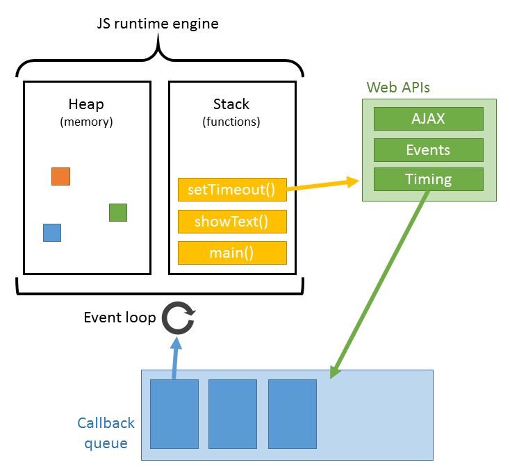

[https://developer.mozilla.org/en-US/docs/Web/JavaScript/EventLoop](https://developer.mozilla.org/en-US/docs/Web/JavaScript/EventLoop)

[https://javascript.info/event-loop](https://javascript.info/event-loop)

## The event loop

The _event loop_ concept is very simple. There's an endless
loop, where the JavaScript engine waits for tasks, executes them and
then sleeps, waiting for more tasks.

The general algorithm of the engine:

1. While there are tasks:
    - execute them, starting with the oldest task.
2. Sleep until a task appears, then go to 1.



队列里面的都是宏任务（Task）

在以下时机，任务会被添加到任务队列：

- 一段新程序或子程序被直接执行时（比如从一个控制台，或在一个 [`<script>`](https://developer.mozilla.org/zh-CN/docs/Web/HTML/Element/script) 元素中运行代码）。
- 触发了一个事件，将其回调函数添加到任务队列时。
- 执行到一个由 [`setTimeout()`](https://developer.mozilla.org/zh-CN/docs/Web/API/setTimeout) 或 [`setInterval()`](https://developer.mozilla.org/zh-CN/docs/Web/API/setInterval) 创建的 timeout 或 interval，以致相应的回调函数被添加到任务队列时。


异步任务需要适当的管理。为此，ECMA 标准规定了一个内部队列 `PromiseJobs`，通常被称为"微任务队列（microtask queue）"（V8 术语）。


**每个宏任务之后，引擎会立即执行微任务队列中的所有任务，然后再执行其他的宏任务，或渲染，或进行其他任何操作。**

```JavaScript
setTimeout(() => alert("timeout"));

Promise.resolve()
  .then(() => alert("promise"));

alert("code");
```

这里的执行顺序是怎样的？

1. `code` 首先显示，因为它是常规的同步调用。
2. `promise` 第二个出现，因为 `then` 会通过微任务队列，并在当前代码之后执行。
3. `timeout` 最后显示，因为它是一个宏任务。


### [Stack](https://developer.mozilla.org/en-US/docs/Web/JavaScript/EventLoop#stack)

Function calls form a stack of _frames_.

### [Heap](https://developer.mozilla.org/en-US/docs/Web/JavaScript/EventLoop#heap)

Objects are allocated in a heap which is just a name to denote a large (mostly unstructured) region of memory.

### [Queue](https://developer.mozilla.org/en-US/docs/Web/JavaScript/EventLoop#queue)

A JavaScript runtime uses a message queue, which is a list of messages to be processed. Each message has an associated function that gets called to handle the message.

### ["Run-to-completion"](https://developer.mozilla.org/en-US/docs/Web/JavaScript/EventLoop#run-to-completion)

Each message is processed completely before any other message is processed.


Window event loop

The window event loop is the one that drives all of the windows
sharing a similar origin (though there are further limits to this, as
described below).


Worker event loop

A worker event loop is one which drives a worker; this includes all forms of workers, including basic [web workers](https://developer.mozilla.org/en-US/docs/Web/API/Web_Workers_API), [shared workers](https://developer.mozilla.org/en-US/docs/Web/API/SharedWorker), and [service workers](https://developer.mozilla.org/en-US/docs/Web/API/Service_Worker_API).
Workers are kept in one or more agents that are separate from the
"main" code; the browser may use a single event loop for all of the
workers of a given type or may use multiple event loops to handle them.


Worklet event loop

A [worklet](https://developer.mozilla.org/en-US/docs/Web/API/Worklet)
event loop is the event loop used to drive agents which run the code
for the worklets for a given agent. This includes worklets of type
[`Worklet`](https://developer.mozilla.org/en-US/docs/Web/API/Worklet), [`AudioWorklet`](https://developer.mozilla.org/en-US/docs/Web/API/AudioWorklet), and [`PaintWorklet`](https://developer.mozilla.org/en-US/docs/Web/API/PaintWorklet).